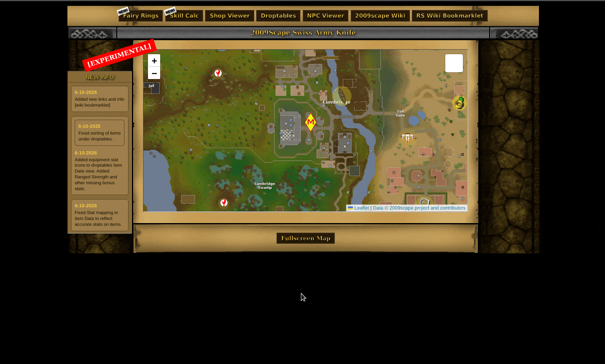

---

---
---

# 2009scape Swiss Army Knife

---

The 2009scape Swiss Army Knife is a combination of tools by many developers, combined into one by player - **Geekstreek**

### 
<u>Preview</u>

---

## Thanks to:
- **2009Scape Developers and Community** - https://2009scape.org/
- **TheDiscordian** for the NPC Viewer - [GitHub Repo](https://github.com/TheDiscordian/2009ScapeNPCViewer)
- **DownTheCrop** for the Droptables concept - [GitHub Repo](https://github.com/downthecrop/2009-droptables)
- **Zencro2009 / Szumaster** for the World Map - [GitHub Repo](https://github.com/zencro2009/2009scapeWorldTranspoMap)
- **Geekstreek** for rewriting the droptable, writing the skill calculator and combining all the tools into one unified page